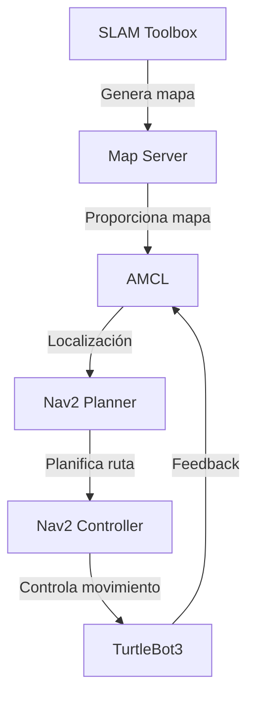

# HispanoTech-UGC-ROS2

Repositorio oficial de exploración y navegación autónoma con ROS2 para TurtleBot3, desarrollado por el equipo HispanoTech dentro del marco de prácticas y proyectos académicos.

**Repositorio GitHub:**  
https://github.com/HispanoTech-UGC/HispanoTech-UGC-ROS2/

---

## Descripción general

Este proyecto se compone de múltiples paquetes ROS2 organizados para cubrir dos grandes funcionalidades:

- **SLAM en tiempo real:** mapeado del entorno con `slam_toolbox`.
- **Navegación/localización sobre mapa estático:** uso de `map_server` y mapas previamente generados.

El sistema está diseñado para ser modular y escalable, permitiendo la integración de nuevos componentes y funcionalidades según sea necesario.

---

## Estructura del repositorio

La estructura del repositorio está organizada de la siguiente manera:

```
HispanoTech-UGC-ROS2/
├── src/
│   ├── hispano_slam/              # SLAM en tiempo real con slam_toolbox
│   │   ├── launch/                # Archivos de lanzamiento para SLAM
│   │   ├── config/                # Configuración de parámetros de SLAM
│   │   └── rviz/                  # Configuración de visualización en RViz
│   ├── provide_hispano_map/       # Proveedor de mapas estáticos
│   │   ├── map/                   # Mapas estáticos en formato YAML y PGM
│   │   ├── launch/                # Archivos de lanzamiento para cargar mapas
│   │   └── rviz/                  # Configuración de visualización en RViz
│   ├── hispanotech_map/           # Mundo y entorno simulado en Gazebo
│   │   ├── launch/                # Archivos de lanzamiento para simulación
│   │   ├── config/                # Configuración de parámetros de simulación
│   │   └── models/                # Modelos personalizados para Gazebo
│   └── hispanotech_nav_system/    # Sistema de navegación autónoma
│       ├── launch/                # Archivos de lanzamiento para navegación
│       ├── config/                # Configuración de parámetros de navegación
│       └── bt_trees/              # Árboles de comportamiento para Nav2
├── hispanorunner.py               # Script Python para lanzar el sistema paso a paso
├── install/, build/, log/         # Directorios generados tras compilar
```

---

## Diagrama de arquitectura

A continuación se presenta un diagrama de alto nivel que describe la arquitectura del sistema:



---

## Paquetes incluidos

### 1. `hispano_slam`

Paquete para realizar SLAM en tiempo real con `slam_toolbox`.

- Lanza `slam_toolbox` en modo síncrono.
- Visualiza el entorno en RViz.
- Mapea mientras el robot se mueve.
- Parámetros personalizados en `config/slam_params.yaml`.

Lanzamiento:

```bash
ros2 launch hispano_slam slam_toolbox.launch.py
```

---

### 2. `provide_hispano_map`

Paquete para cargar un mapa ya existente mediante `map_server`.

- Carga `.yaml` y `.pgm` del mapa.
- Lanza RViz y visualiza el entorno.
- Usa `lifecycle_manager` y transformaciones necesarias.

Lanzamiento:

```bash
ros2 launch provide_hispano_map provide_hispano_map.launch.py
```

---

### 3. `hispanotech_nav_system`

Paquete para la navegación autónoma utilizando mapas estáticos y el sistema de navegación de Nav2.

- Configuración personalizada para `planner_server`, `controller_server` y `bt_navigator`.
- Integración con `map_server` y `amcl` para localización.
- Parámetros en `config/nav_params.yaml`.

Lanzamiento:

```bash
ros2 launch hispanotech_nav_system navigation.launch.py
```

---

### 4. `hispanorunner.py`

Script Python auxiliar que automatiza el lanzamiento en orden de:

- Gazebo
- Mapa estático
- Teleoperación
- Carga y activación del mapa

Ejecución:

```bash
python3 hispanorunner.py
```

---

## Guardar mapas con SLAM

Tras completar la exploración:

```bash
ros2 run nav2_map_server map_saver_cli -f ~/nombre_mapa
```

Esto genera:

- `nombre_mapa.yaml`
- `nombre_mapa.pgm`

Puedes moverlos al directorio `provide_hispano_map/map/` para su reutilización.

---

## Requisitos principales

```bash
sudo apt install   ros-humble-slam-toolbox   ros-humble-nav2-map-server   ros-humble-rviz2   ros-humble-turtlebot3*   ros-humble-tf2-tools
```

---

## Estado actual del proyecto

- [x] SLAM funcionando en tiempo real con RViz
- [x] Guardado y reutilización de mapas
- [x] Navegación con mapa estático cargado
- [x] Visualización completa con RViz
- [x] Automatización con `hispanorunner.py`
- [x] Sistema de navegación autónoma con `hispanotech_nav_system`

---

Este proyecto está en desarrollo activo dentro del equipo HispanoTech.
