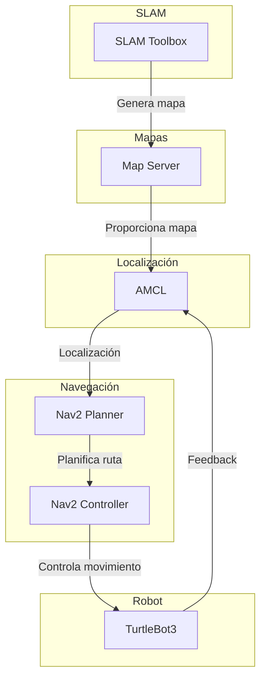
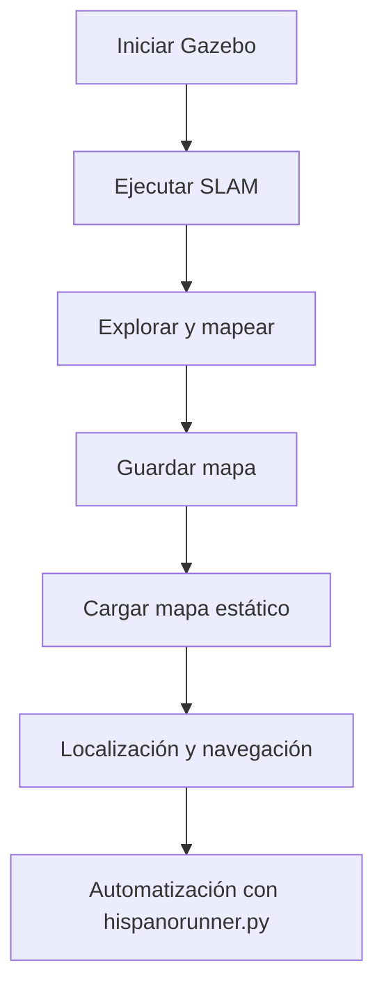
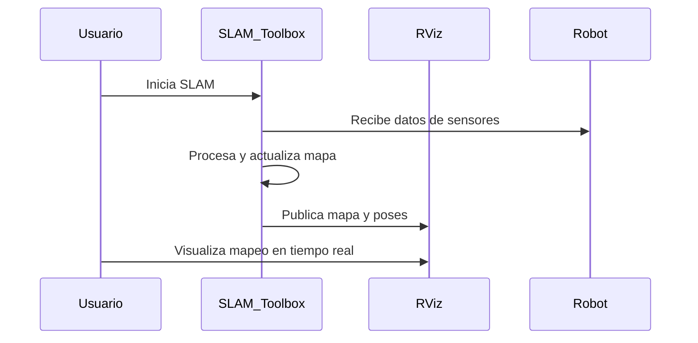
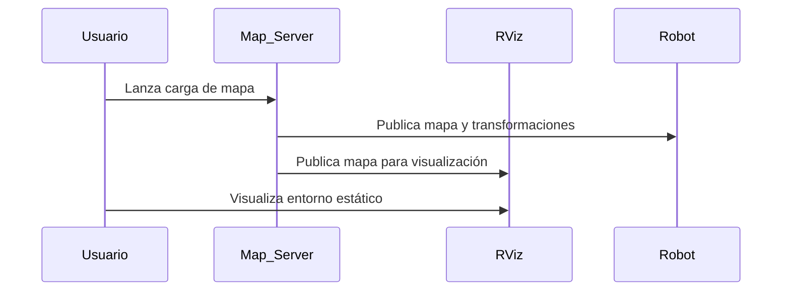
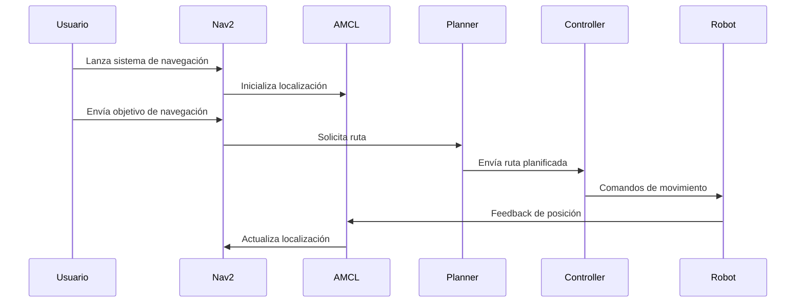
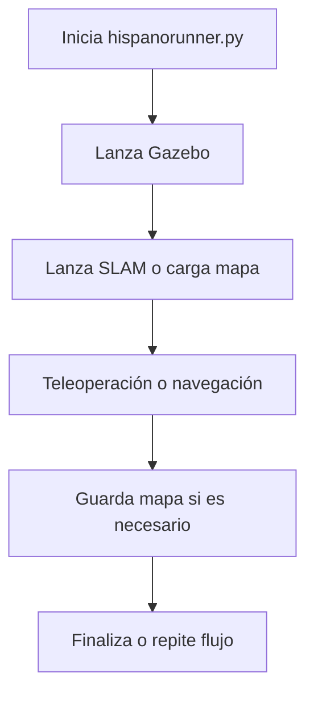

# HispanoTech-UGC-ROS2

[](https://github.com/HispanoTech-UGC/HispanoTech-UGC-ROS2/)
[](https://docs.ros.org/en/humble/index.html)
[](LICENSE)

Repositorio oficial para exploración, mapeo y navegación autónoma con ROS2 en TurtleBot3, desarrollado por el equipo HispanoTech para fines académicos y de investigación.

---

## Tabla de Contenidos
1. [Descripción General](#descripción-general)
2. [Arquitectura del Sistema](#arquitectura-del-sistema)
3. [Estructura del Repositorio](#estructura-del-repositorio)
4. [Instalación y Requisitos](#instalación-y-requisitos)
5. [Uso Básico](#uso-básico)
6. [Flujo de Trabajo Típico](#flujo-de-trabajo-típico)
7. [Paquetes Incluidos](#paquetes-incluidos)
8. [Guardar y Reutilizar Mapas](#guardar-y-reutilizar-mapas)
9. [Créditos y Licencia](#créditos-y-licencia)

---

## Descripción General

Este proyecto ROS2 integra múltiples paquetes para cubrir dos grandes funcionalidades:

- **SLAM en tiempo real:** mapeado del entorno con `slam_toolbox`.
- **Navegación/localización sobre mapa estático:** uso de `map_server` y mapas previamente generados.

El sistema es modular y escalable, permitiendo la integración de nuevos componentes y funcionalidades.

---

## Arquitectura del Sistema

### Diagrama de Alto Nivel


```mermaid
graph TD
    subgraph SLAM
        A[SLAM Toolbox]
    end
    subgraph Mapas
        B[Map Server]
    end
    subgraph Localización
        C[AMCL]
    end
    subgraph Navegación
        D[Nav2 Planner]
        E[Nav2 Controller]
    end
    subgraph Robot
        F[TurtleBot3]
    end
    A -- Genera mapa --> B
    B -- Proporciona mapa --> C
    C -- Localización --> D
    D -- Planifica ruta --> E
    E -- Controla movimiento --> F
    F -- Feedback --> C
```

### Diagrama de Flujo de Uso Típico


```mermaid
flowchart TD
    S1[Iniciar Gazebo] --> S2[Ejecutar SLAM]
    S2 --> S3[Explorar y mapear]
    S3 --> S4[Guardar mapa]
    S4 --> S5[Cargar mapa estático]
    S5 --> S6[Localización y navegación]
    S6 --> S7[Automatización con hispanorunner.py]
```

---

## Estructura del Repositorio

```text
HispanoTech-UGC-ROS2/
├── src/
│   ├── hispano_slam/              # SLAM en tiempo real con slam_toolbox
│   │   ├── launch/                # Archivos de lanzamiento para SLAM
│   │   ├── config/                # Configuración de parámetros de SLAM
│   │   └── rviz/                  # Configuración de visualización en RViz
│   ├── provide_hispano_map/       # Proveedor de mapas estáticos
│   │   ├── map/                   # Mapas estáticos en formato YAML y PGM
│   │   ├── launch/                # Archivos de lanzamiento para cargar mapas
│   │   └── rviz/                  # Configuración de visualización en RViz
│   ├── hispanotech_map/           # Mundo y entorno simulado en Gazebo
│   │   ├── launch/                # Archivos de lanzamiento para simulación
│   │   ├── config/                # Configuración de parámetros de simulación
│   │   └── models/                # Modelos personalizados para Gazebo
│   └── hispanotech_nav_system/    # Sistema de navegación autónoma
│       ├── launch/                # Archivos de lanzamiento para navegación
│       ├── config/                # Configuración de parámetros de navegación
│       └── bt_trees/              # Árboles de comportamiento para Nav2
├── hispanorunner.py               # Script Python para lanzar el sistema paso a paso
├── docs/                          # Documentación e imágenes
├── install/, build/, log/         # Directorios generados tras compilar
├── README.md, LICENSE             # Documentación y licencia
```

---

## Instalación y Requisitos

### Requisitos Principales

- Ubuntu 22.04
- ROS2 Humble Hawksbill
- TurtleBot3 (Burger/Waffle Pi)

### Instalación de Dependencias

```bash
sudo apt update && sudo apt install \
  ros-humble-slam-toolbox \
  ros-humble-nav2-map-server \
  ros-humble-rviz2 \
  ros-humble-turtlebot3* \
  ros-humble-tf2-tools
```

### Clonación y Compilación

```bash
git clone https://github.com/HispanoTech-UGC/HispanoTech-UGC-ROS2.git
cd HispanoTech-UGC-ROS2
source /opt/ros/humble/setup.bash
colcon build --symlink-install
source install/setup.bash
```

---

## Uso Básico

### 1. Lanzar SLAM en tiempo real

```bash
ros2 launch hispano_slam slam_toolbox.launch.py
```

### 2. Guardar el mapa generado

```bash
ros2 run nav2_map_server map_saver_cli -f ~/nombre_mapa
```

### 3. Cargar un mapa estático

```bash
ros2 launch provide_hispano_map provide_hispano_map.launch.py
```

### 4. Lanzar el sistema de navegación autónoma

```bash
ros2 launch hispanotech_nav_system navigation.launch.py
```

### 5. Automatización completa

```bash
python3 hispanorunner.py
```

---

## Flujo de Trabajo Típico

1. **Simulación:** Iniciar Gazebo y el entorno simulado.
2. **SLAM:** Ejecutar SLAM y explorar el entorno.
3. **Guardar mapa:** Al finalizar, guardar el mapa generado.
4. **Cargar mapa:** Usar el mapa guardado para navegación autónoma.
5. **Navegación:** Lanzar el sistema de navegación y enviar objetivos.
6. **Automatización:** Usar `hispanorunner.py` para simplificar el proceso.

---

## Paquetes Incluidos

### 1. `hispano_slam`
- SLAM en tiempo real con `slam_toolbox`.
- Visualización en RViz.
- Parámetros en `config/slam_params.yaml`.

### 2. `provide_hispano_map`
- Carga mapas estáticos (`.yaml` y `.pgm`).
- Visualización en RViz.
- Uso de `lifecycle_manager` y transformaciones.

### 3. `hispanotech_nav_system`
- Navegación autónoma con Nav2.
- Configuración personalizada para `planner_server`, `controller_server`, `bt_navigator`.
- Integración con `map_server` y `amcl`.

### 4. `hispanorunner.py`
- Script Python para lanzar todo el sistema paso a paso (simulación, mapa, teleoperación, navegación).

---

## Guardar y Reutilizar Mapas

Tras completar la exploración:

```bash
ros2 run nav2_map_server map_saver_cli -f ~/nombre_mapa
```

Esto genera:
- `nombre_mapa.yaml`
- `nombre_mapa.pgm`

Mueve estos archivos a `src/provide_hispano_map/map/` para su reutilización.

---

## Créditos y Licencia

Desarrollado por el equipo HispanoTech (UGC).

- [Repositorio principal](https://github.com/HispanoTech-UGC/HispanoTech-UGC-ROS2/)
- Licencia: MIT

---

## Diagramas de Funcionamiento

### Funcionamiento de SLAM (`hispano_slam`)


```mermaid
sequenceDiagram
    participant Usuario
    participant SLAM_Toolbox
    participant RViz
    participant Robot
    Usuario->>SLAM_Toolbox: Inicia SLAM
    SLAM_Toolbox->>Robot: Recibe datos de sensores
    SLAM_Toolbox->>SLAM_Toolbox: Procesa y actualiza mapa
    SLAM_Toolbox->>RViz: Publica mapa y poses
    Usuario->>RViz: Visualiza mapeo en tiempo real
```

### Proceso de Carga de Mapas (`provide_hispano_map`)


```mermaid
sequenceDiagram
    participant Usuario
    participant Map_Server
    participant RViz
    participant Robot
    Usuario->>Map_Server: Lanza carga de mapa
    Map_Server->>Robot: Publica mapa y transformaciones
    Map_Server->>RViz: Publica mapa para visualización
    Usuario->>RViz: Visualiza entorno estático
```

### Navegación Autónoma (`hispanotech_nav_system`)


```mermaid
sequenceDiagram
    participant Usuario
    participant Nav2
    participant AMCL
    participant Planner
    participant Controller
    participant Robot
    Usuario->>Nav2: Lanza sistema de navegación
    Nav2->>AMCL: Inicializa localización
    Usuario->>Nav2: Envía objetivo de navegación
    Nav2->>Planner: Solicita ruta
    Planner->>Controller: Envía ruta planificada
    Controller->>Robot: Comandos de movimiento
    Robot->>AMCL: Feedback de posición
    AMCL->>Nav2: Actualiza localización
```

### Automatización con `hispanorunner.py`


```mermaid
flowchart TD
    A[Inicia hispanorunner.py] --> B[Lanza Gazebo]
    B --> C[Lanza SLAM o carga mapa]
    C --> D[Teleoperación o navegación]
    D --> E[Guarda mapa si es necesario]
    E --> F[Finaliza o repite flujo]
```

---

Este proyecto está en desarrollo activo. ¡Contribuciones y sugerencias son bienvenidas!
